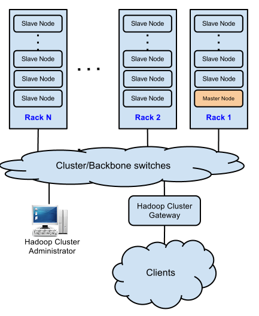
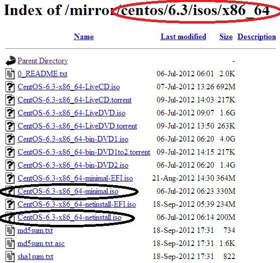
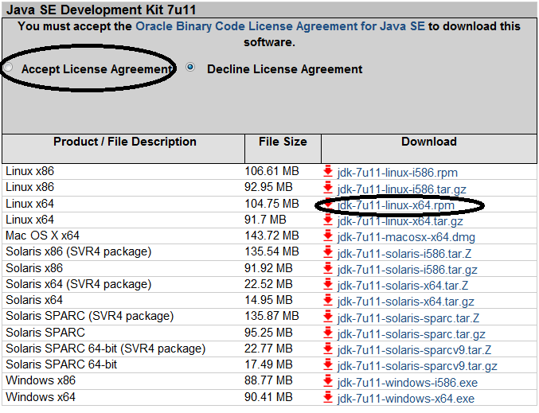

{id="chapter-2"}
# Preparing for Hadoop Installation 

In this chapter, we will cover:

- Choosing hardware for cluster nodes
- Designing the cluster network
- Configuring the cluster administrator machine
- Creating kickstart file and boot media
- Installing the Linux operating system
- Installing Java and other tools
- Configuring SSH

## Introduction 

The configuration of a Hadoop cluster is a systematic project,
especially, due to its large scale and the distributed property. Efforts
are needed in choosing the proper storage and computing hardware,
designing the interconnected network and installing and configuring the
operating system and so on.

In a Hadoop cluster, different types of nodes may require different
hardware configurations. For example, the JobTracker on a master node
schedules jobs and assigns tasks to proper slave nodes for execution and
the NameNode on the master node manages the metadata for files and data
blocks. In addition, the master node is a critical point of failure in a
default cluster configuration of having only one master node. A critical
requirement for the master node is to be responsive and reliable.
Comparatively, a slave node is responsible for hosting data blocks and
running map/reduce tasks upon the data blocks. Hadoop was build on the
assumption that hardware is not reliable. So, failure resillience has
been built intrinsically into the Hadoop framework. Hadoop is not only
resillient on data blocks but also on the MapReduce framework. When data
blocks are corrupted, other replicated blocks will be used to replace it
and when a map/reduce task fails, the task will be restarted on other
machine. But as of this book writing, Hadoop has single point of failure
on the NameNode as well as the Jobtracker. Because these two daemons are
single point of failure. When these two daemons encounter problems, the
Hadoop cluster halts. The susceptibility to failure requires that the
machine that is running the NameNode and the JobTracker be more reliable
than all other nodes. On the other hand, a slave node can always use
other nodes as backup, and thus doesn't need to have so strict
requirements on reliability as long as it has enough storage space and
computing power.

The size of a Hadoop cluster is another factor for selection hardware,
especially for the master node. For example, for a small to medium sized
cluster with up to a hundred slave nodes, the NameNode, JobTracker and
SecondaryNameNode daemons can be put on the same master machine. When
the cluster size grows up to hundreds even thousands of slave nodes, it
is advisable to put these daemons on different machines. In this book,
we are assuming to build a Hadoop cluster with $5$ slave nodes for
illustration purposes. This makes it reasonable to put the NameNode,
JobTracker and SecondaryNameNode daemons on the same physical machine.

All the nodes in a Hadoop cluster are interconnected through network
devices such as switches and routers. Data flows from one node to
another over the network during a MapReduce job. The configuration and
stability of the cluster network is critical to the stability of the
whole cluster. If network segmentation happens, the whole cluster can
become too unreliable to be even unusable. So, highly available and
resilient network architecture is one of the most important task.

Hadoop runs on Linux (although Windows operating systems are supported,
it is still not stable as of this book writing). So, a working Linux OS
is the prerequisite of configuration a Hadoop cluster. If you have
experience working with Linux, you may know that installing Linux on a
single machine is straightforward by following the installation
instructions. For example, we can burn the downloaded operating system
ISO image onto a DVD optical disk and then boot and install the
operating system using this DVD. However, the simple and straightforward
installation method is too inefficient to be practical for a Hadoop
cluster with a large number of nodes. We are going to explore more
practical and efficient installation methods in this chapter.

Some operating system configuration is needed after installing the Linux
operating system. For example, we need to configure users and groups,
system security such as firewalls and SELinux. We also need to install
the required Hadoop dependency software, Java and some optional tools
that can improve cluster management efficiency.

## Choosing hardware for cluster nodes

A Hadoop cluster contains two types of nodes: master node and slave
node. By default, the NameNode, SecondaryNameNode and JobTracker daemons
reside on a master node; DataNode and TaskTracker daemons reside on
slave nodes. Properly selecting hardware for these computing and storage
nodes can maximize the efficiency of a Hadoop cluster. In this recipe,
we will list suggestions on hardware selection for a computing node.

### How to do it 

Although special requirements exist for a master node and a slave node,
there is no gold standard for choosing optimal hardware for both types
of nodes. It is reasonable to say that the hardware configuration is
closely related to the properties of Big Data to be processed. In
addition, the choice of hardware is an empirical and adaptive process
with the changing requirements on a Hadoop cluster. For example, if the
requirements for the throughput of a Hadoop cluster are high, we might
need to choose high end CPUs and hard drives. If we have a large number
of potential Hadoop users, we may need to upgrade the hardware
configuration for both the master node and the slave nodes.

Empirically, the [hardware recommendation table](#tbl:cluster.hardware)
shows the hardware configurations for a small to medium sized Hadoop
cluster.

{id="tbl:cluster.hardware"}
|  Node Type  | Node Components | Recommended Specification        |
|-------------|:----------------|:---------------------------------|
| Master Node |       CPU       | {$$}\ge{/$$} 2 Quad Core, 2.0GHz |
|-------------|-----------------|----------------------------------|
|             |       RAM       | {$$}\ge{/$$} 16GB                |
|-------------|-----------------|----------------------------------|
|             |    Hard Drive   | {$$}\ge{/$$} 2 x 1TB SATA 7200 RPM HDD or SSD[^1]|
|-------------|-----------------|----------------------------------|
|             |  Network Card   | {$$}\ge{/$$} 1Gbps Ethernet      |
|-------------|-----------------|----------------------------------|
|  Slave Node |       CPU       | {$$}\ge{/$$} 2 Quad Core         |
|-------------|-----------------|----------------------------------|
|             |       RAM       | {$$}\ge{/$$} 16GB                |
|-------------|-----------------|----------------------------------|
|             |    Hard Drive   | {$$}\ge{/$$} 4 x 1TB HDD         |
|-------------|-----------------|----------------------------------|
|             |  Network Card   | {$$}\ge{/$$} 1Gbps Ethernet      |

### How it works 

On a Hadoop master node, the NameNode keeps the metadata such as
permissions of each file in main memory. The amount of memory needed by
a master node depends on the number of file system objects (for example,
numbers of files and block replicas) to be created and tracked. The
memory requirement will be high when the cluster is large. The
SecondaryNameNode keeps a backup for the latest filesystem checkpoint
mirrored from the NameNode, so its memory requirement is similar as the
NameNode.

In default configuration, the master node is a single failure point.
Higher end computing hardware and secondary power supplies are
suggested.

In Hadoop, each slave node simultaneously executes a number of map or
reduce tasks. The maximum number of parallel map/reduce tasks are known
as map/reduce slots, which are configurable by a Hadoop administrator.
Each slot is a computing unit consisting of CPU, memory and disk I/O
resources. When a slave node was assigned a task by the JobTracker, its
TaskTracker will fork a JVM for that task, allocating a preconfigured
amount of computing resources. In addition, each forked JVM also will
incur a certain amount of memory requirements. Empirically, a Hadoop job
can consume 1-2 GB memory for each CPU core. Higher data throughput
requirement can incur higher I/O operations for the majority of Hadoop
jobs. That's why higher end and parallel hard drives can help boost the
cluster performance. To maximize parallelism, it is advisable to assign
two slots for each CPU core. For example, if our slave node has two
quad-core CPUs, we can assign $2 \times 4 \times 2 = 16$ (map only,
reduce only or both) slots in total for this node.

In the simple equation, the first 2 stands for the number of CPUs of the
slave node, the number 4 represents the number of cores per CPU and the
second 2 means the number of slots per CPU core.

### See also 

- Designing the cluster network
- Managing HDFS cluster in Chapter [chap:4], Managing a Hadoop
    cluster.
- Chapter [chap:7], Tuning Hadoop cluster for best performance.

## Designing the cluster network

Network is the backbone of a Hadoop cluster. Its stability is critical
for the performance of the cluster. In this recipe, we will outline a
few general rules for designing a Hadoop cluster network.

### How to do it 

The network architecture for a small to medium sized cluster can be as
simple as connecting the cluster nodes with one or more switches.
Connection redundancy can add reliability to the network.

Warning!\
Computing nodes in a Hadoop cluster should be configured within the same
network segment (Local Area Network or LAN). Advanced features such as
VLANs that can cause overhead are not recommended. And connecting nodes
with a router is not recommended.

The network architecture for Hadoop clusters with hundreds or thousands
of nodes is much more complex. In a large cluster, the physical nodes
are usually so small, for example blade server, that they can be mounted
on racks. Each rack has a local switch that interconnects nodes on the
save rack. These racks are then interconnected with more advanced
switches.

Nodes on the same rack can be interconnected with 1Gbps (Gigabit per
second) Ethernet switch. Cluster level switches then connect the rack
switches with faster links such as 10Gbps optical fiber links and other
networks like InfiniBand. The cluster-level switches may also
interconnect with other cluster-level switches or even uplink to another
higher level of switching infrastructure. With the increasing size of a
cluster, the network, at the same time, will become larger and more
complex. Connection redundancies for network high availability can also
increase its complexity. In this book, we assume to discuss the basic
network architecture design method. If you want to learn more advanced
network design techniques, please refer to related books and online
materials.

In general, the [network architecture figure](#fig:network.arch) of medium
sized cluster describes how the hadoop servers should be configured. 

{id="fig:network.arch"}

In this figure, we assume there is a Hadoop cluster administrator
machine and the clients connect to the cluster through a gateway,
through which Hadoop jobs can be submitted.

### How it works 

The increasing bandwidth of network devices makes it possible for Hadoop
to load and replicate large data sets across interconnected nodes.
Resilient and scalable network architecture can secure the high data
throughput and performance requirements for a Hadoop cluster.

## Configuring the cluster administrator machine

As we have mentioned previously, the most efficient way to install Linux
on a large number of machines is to install over the network. In this
book, we assume to use the administrator machine as the installation
server. We will learn steps to configure this server, including the
configuration of the following two services: `DHCP` and `FTP`.

### Getting ready 

Before getting started, we assume that the cluster administrator machine
has a 64bit Red Hat compatible Linux operating system installed. The
hostname of the machine is hadoop.admin and an administrative user
hdadmin has been created. This user should have `sudo` privileges to
install software packages, configure system services and so on. We also
assume administrative tools such as a command line text editor has been
installed on this machine. We will use these tools and commands directly
in the upcoming recipes.

In this book, we assume to use CentOS 6.3 (which corresponds to Red Hat
Enterprise Linux (RHEL) 6.3) as the Linux distribution. We will follow
the Red Hat syntax for all the administrative commands, if you are using
a Linux distribution other than CentOS, such as Debian, please refer to
corresponding documentation.

Login to the administrator machine as hdadmin and change the hostname of
the machine with command:

    $ sudo sed -i 's/\^HOSTNAME.*\$/HOSTNAME=hadoop.admin/' /etc/sysconfig/network

Create directories with command:

    $ mkdir -v ~/mnt ~/isoimages ~/repo

We will use directory `/mnt` as the mount point for ISO images. Directory
`~/isoimages` will be used to contain the original image files and
directory `/repo` will be used as the repository folder for network
installation.

Install `DHCP` and `FTP` servers on the machine with commands:

	$ sudo yum -y install dhcp
	$ sudo yum -y install vsftpd

We will use the `DHCP` server to assign IP addresses and bootstrap the
operating system in the installation process and use the `FTP` server to
host the installation packages.

### Download the latest ISO image from a mirror 

The CentOS official site provides a worldwide mirrors list, including
North America, European Countries, South America, Asia, Oceania, Middle
East, Africa and other regions.

After selecting the nearest mirror, we can use either `HTTP` or `FTP` to
download the image. Let's choose `FTP` as the download method by clicking
the link in the corresponding line of the selected mirror. Then choose
`6.3/, isos/, x86_64/` consecutively. In this directory as shown in
Figure below, we choose to download two ISO image files.
Image file `CentOS-6.3-x86_64-minimal.iso` contains all the necessary
installation packages. And image file `CentOS-6.3-x86_64-netinstall.iso`
contains PXE network booting files used for booting over the network.

{id="fig:dir.mirror"}

If you are not sure about the architecture of the cluster machines,
please refer to the product hardware menu.

Alternatively, we can use the following rsync to download the image:

    $ rsync rsync://mirror.its.dal.ca/centos/6.3/isos/x86_64/ CentOS-6.3-x86_64-netinstall.iso ~/isoimages

We can also use the following wget command to download the image file:

	$ wget http://mirror.its.dal.ca/centos/6.3/isos/x86_64/ CentOS-6.3-x86_64-netinstall.iso -P ~/isoimages

Mount the image file with command:

	$ sudo mount $~/isoimages/ CentOS-6.3-x86_64-minimal.iso ~/$mnt

Copy all the files to the `~/repo` directory for `FTP` hosting with
command:

    $ cp -r $~/mnt/* ~/$repo

Un-mount the ISO image with command:

    $ sudo umount /mnt

The directory tree of the minimal image is similar to the following:

    Insert the output of the directory listing.

The directory tree of the netinstall image is similar to the following:

    output of the directory listings.

We can see from the directory trees that the minimal installation image
file contains packages and boot images for system installation. The
netinstall package only contains files for booting, including network
booting files in the `images/pxeboot` directory.

### How to do it 

Use the following recipe configure `DHCP` server:

Use your favorite text editor to open file `/etc/dhcp/dhcpd.conf` and
change the following content:

    # Domain name
    option domain-name "hadoop.cluster";

    # DNS hostname or IP address
    option domain-name-servers
    dlp.server.world;

    # Default lease time
    default-lease-time 600;

    # Maximum lease time
    max-lease-time 7200;

    # Declare the DHCP server to be valid.
    authoritative;

    # Network address and subnet mask
    subnet 10.0.0.0 netmask 255.255.255.0 {

    # Range of lease IP address, should be based
    # on the size of the network
    range dynamic-bootp 10.0.0.200 10.0.0.254;

    # Broadcast address
    option broadcast-address 10.0.0.255;

    # Default gateway
    option routers 10.0.0.1;
    }

Start `DHCP` server with command:

    $ sudo service dhcpd start

The `DHCP` server start with the following message:

    Starting dhcpd: [  OK  ]

Make the `DHCP` server to survive a system reboot:

    $ sudo chkconfig dhcpd --level 3 on

Use the following recipe to configure `FTP` server:\

Open file `/etc/vsftpd/vsftpd.conf` with your favorite text editor and
change the content according to the following list:

    # The FTP server will run in stand alone mode.
    listen=YES

    # Use Anonymous user.
    anonymous_enable=YES

    # Disable change root for local users.
    chroot_local_user=NO

    # Disable uploading and changing files.
    write_enable=NO

    # Enable logging of uploads and downloads.
    xferlog_enable=YES

    # Enable port 20 data transfer.
    connect_from_port_20=YES

    # Specify directory for hosting the Linux installation packages.
    anon_ropot=~/repo

Start the `FTP` server with command:

    $ sudo service vsftpd start

The server will start with the following message:
    Starting vsftpd: [  OK  ]

Verify the `FTP` configuration with command:
    ftp hadoop.admin

The configuration is successful if we get the following message:

    Trying 10.0.0.1...
    Connected to hadoop.admin (10.0.0.1).
    220 (vsFTPd 3.0.0)
    Name (knoesis157:hdadmin):

### See also 

- Creating kickstart file and boot media in Chapter 2, Preparing for
  Hadoop Installation.
- Installing the Linux operating system in Chapter 2, Preparing for
  Hadoop installation.

## Creating kickstart file and boot media

Installing Linux on a large number of nodes with a kickstart file has a
few advantages. For example, the installation process can be automated
by specifying a list of to-be-installed packages and configuring system
settings for the post installation process.

In this section, we will cover steps of creating a kickstart file and a
USB boot media with the operating system image.

### Getting ready 

A kickstart file is plain text file used for the automatic installation
of Linux.

Prepare a USB flash drive with storage capacity larger than 512MB. The
drive should have a single vfat file system partition. We can use the
following command to check the filesystem type:

    $ blkid

We should see message similar to:

    /dev/sdb1 SEC_TYPE="msdos" LABEL="LIVE" UUID="07D9-051C" TYPE="vfat"

If the TYPE attribute is other than 'vfat', use the following command to
clear the first few blocks of the drive:

    $ dd if=/dev/zero of=/dev/sdb1 bs=1M count=100

Login to the administrative machine with command:

    $ ssh hdadmin@hadoop.admin

### How to do it 

Use the following steps to create a kickstart file:

Install kickstart with command:

    $ sudo yum install system-config-kickstart

Use your favourite text editor to create a file `ks.cfg` with the
following content:

    #!/bin/bash
    # Kickstart for CentOS 6.3 for Hadoop cluster.

    # Install system on the machine.
    install

    # Use ftp as the package repository
    url --url ftp://hadoop.admin/repo

    # Use the text installation interface.
    text

    # Use UTF-8 encoded USA English as the language.
    lang en_US.UTF-8

    # Configure time zone.
    timezone America/New_York

    # Use USA keyboard.
    keyboard us

    # Set bootloader location.
    bootloader --location=mbr --driveorder=sda rhgb quiet

    # Set root password
    rootpw  --password=hadoop

    ################################
    # Partion the hard disk
    ################################

    # Clear the master boot record on the hard drive.
    zerombr yes

    # Clear existing partitions.
    clearpart --all --initlabel

    # Create /boot partition, size is in MB.
    part /boot --fstype ext3 --size 128

    # Create / (root) partition.
    part / --fstype ext3 --size 4096 --grow --maxsize 8192

    # Create /var partition.
    part /var --fstype ext3 --size 4096 --grow --maxsize 8192

    # Create Hadoop data storage directory.
    part /hadoop --fstype ext3 --grow

    # Create swap partition, 16GB, double size of the main memory.
    # Change size according to your hardware memory configuration.
    part swap --size 16384

    #################################
    # Configure Network device.
    #################################

    # Use DHCP and disable IPv6.
    network --onboot yes --device eth0 --bootproto dhcp --noipv6

    # Disable firewall.
    firewall --disabled

    # Configure authorization.
    authconfig --enableshadow

    # Put Selinux in permissive mode.
    selinux --permissive

    ############################################
    # Specify packages to install.
    ############################################

    # Automatically resolve package dependencies,
    # exclude installation of documents and ignore missing packages.
    %packages --resolvedeps --excludedocs --ignoremissing

    # Install core packages.
    @Base

    # Don't install OpenJDK.
    -java

    # Install wget.
    wget

    # Install the vim text editor.
    vim

    # Install the Emacs text editor.
    emacs

    # Install rsync.
    rsync

    # install nmap network mapper.
    nmap

    %end

    ####################################
    # Post installation configuration.
    ####################################

    # Enable post process logging.
    %post --log=~/install-post.log

    # Create Hadoop user hduser with password hduser.
    useradd -m -p hduser hduser

    # Create group Hadoop.
    groupadd hadoop

    # Change user hduser's current group to hadoop.
    usermod -g hadoop hduser

    # Tell the nodes hostname and ip address of the admin machine.
    echo "10.0.0.1 hadoop.admin" >> /etc/hosts

    # Configure administrative privilege to hadoop group.

    # Configure the kernel settings.
    ulimit -u

    #########################
    # Startup services.
    #########################

    service sshd start
    chkconfig sshd on

    %end

    # Reboot after installation.
    reboot

    # Disable first boot configuration.
    firstboot --disable

Put the kickstart file into the root directory of the `FTP` server with
command:

    $ cp ks.cfg ~/repo

This will make the kickstart file available during the installation
process.

Create a USB boot media with the following recipe:

Use a text editor to open file `~/isolinux/grub.conf` and add the
following content:

    default=0
    splashimage=@SPLASHPATH@
    timeout 0
    hiddenmenu
    title @PRODUCT@ @VERSION@
    	kernel @KERNELPATH@ ks=ftp://hadoop.admin/ks.cfg
    	initrd @INITRDPATH@

Make an ISO file from the isolinux directory with the following
commands:

	mkisofs -o CentOS6.3-x86_64-boot.iso \
		-b ~/repo/isolinux/isolinux.bin \
		-c ~/repo/isolinux/boot.cat \
		-no-emul-boot \
		-boot-load-size 4

Plugin a USB flash drive on the administrator machine and write the
bootable ISO image into the USB flash drive with the following command
(assuming the USB drive corresponds to `/dev/sdb` device file):

    $ dd if=~/CentOS6.3-x86_64-boot.iso of=/dev/sdb

**Warning!**
Make sure you have a backup of the data on the USB flash drive, all the
information will be wiped out when we write the ISO image file into the
drive.

### How it works 

A kickstart file specifies a number of installation options such as
installation media, networking configuration, firewall configuration
etc. Lines that start with `\#` are treated as comments.

The file contains a %packages section, which specifies the packages to
be installed. In this section, both specific packages and package groups
can be specified to install. For example, in our kickstart file, we
configure to install the Linux base package with @Base. In addition, if
a package is not intended to be installed, we can add a dash symbol
before the package. For example, we don't want to install `OpenJDK`, we
can specify this with `-java`.

For a Hadoop cluster, basic packages are enough, so we have ignored the
unnecessary packages in the kickstart file.

The `%post` section allows us to specify configurations and commands after
installation. This is very helpful when we need to do some
administrative configurations after installing the operating system. For
example, we might want to create a regular user for Hadoop with
privileges to run Hadoop commands and to configure system services such
as `SSHD` and `FTP`.

The USB boot media was used to boot a system and start the installation
process automatically. We can specify the following kernel start up
option in the grub.conf file:

       ks=ftp://hadoop.admin/ks.cfg

This option tells the location of the kickstart file. Once the kickstart
file is located and transferred to the local machine, automatic
installation will start.

### There's more 

There are other installation methods other than `FTP`, for example, we can
also use NFS and `HTTP`. The difference of these methods from FTP lies
only in the configuration of the corresponding repository URL. For
example, if we want to use `HTTP` server, we can make the following two
changes in our configuration:

1.  In the kickstart file, change `url --url ftp://hadoop.admin/repo` to
    `url --url http://hadoop.admin:80/repo`.

2.  In the grub.conf file, change the kernel option from
    `ks=ftp://hadoop.admin/ks.cfg` to
    `ks=http://hadoop.admin:80/ks.cfg`.

### See also 

- Installing the Linux operating system

## Installing the Linux operating system

Although there are many ways to install Linux on a machine, installing
over the network with the help of a kickstart file is the most efficient
option. The installation process can be automated requiring minimal
human intervention. A kickstart file can be kept on a server and read by
individual machines during the installation process. In the recipe, we
will outline steps to install Linux on a number of Hadoop nodes over the
network.

### Getting ready 

Before getting started, we need to verify that the `DHCP` server and `FTP`
server are running correctly on the administrative machine.

Use the following command on the administrator machine to check if `DHCP`
server is working properly:

    $ ps -ef | grep dhcp

If this command gives non-empty output, then it is working correctly,
otherwise, we need to start the service with command:

    $ sudo service dhcpd start

Similarly, the following command can be used to check the `FTP` server on
the administrator machine:

    $ ftp hadoop.admin

We should be able to login anonymously and list the kickstart file and
installation packages in the root directory.

In addition, we assume that the cluster nodes have been physically
configured. For example, racks and networking devices are all working
without any issues.

### How to do it 

Use the following recipe to install Linux on a machine:

1.  Plug in the USB flash drive boot media and power on the computer.
2.  Press `F9` to select the boot device.
    Different BIOS versions may have different shortcut keys. If F9 does
    not work, please refer to related product manual.
3.  From the list of boot devices, choose USB or 'Removable Devices'.
4.  When the installation starts, you can remove the boot media and
    start the installation on the next machine.

### How it works 

Linux system was designed to be flexible. And its booting process is
composed of the following stages:

- Power on physical machine
- Choose boot media
- Stage 1 boot loader
- Stage 2 boot loader
- Load the kernel image
- System initialization

After we power on the machine and choose USB as the boot media, the boot
loader, grub in our case, will start to work. Grub contains two boot
loading stages. In stage 1, an executable program will run and load
stage 2. Then stage 2 will load the kernel which resides on boot media.
When installing the operating system, the kernel has very limited
functionality start the installation process, for example, finding the
location of software packages. In our case, the kernel option kickstart
file contains all the specification for the installation process. Thus,
everything will be automated after booting from the USB boot media.

One advantage of separating the boot media from the installation package
repository is that the installation on multiple machines can be
paralleled to reduce the total installation time.

### There's more... 

With the help of a kickstart file, we can automate the installation of
Linux on a number of machines. One disadvantage of this method is that
we need to manually boot each machine. This is tedious and requires a
lot of repetitive work. Even worse, in reality, we may find that a lot
of servers don't even have a monitor or video card installed. This makes
it impractical to use this method. So, we need to explore alternative
methods.

In this part, we will introduce the steps to automate the installation
process with the help of `DHCP` and `TFTP` servers. A `DHCP` server is
configured as a booting server, which serves similarly as a USB drive
boot media and `TFTP` is configured to host the actual operating system
packages.

## Configuring DHCP for network booting

We have mentioned the basic configuration of a `DHCP` server in the
previous section. To enable network booting for `DHCP`, we will use the
Pre-boot Execution Environment (PXE) method of `TFTP`.

Create the configuration file `/etc/dhcpd.conf` for `DHCP` with the
following content:

    option domain-name "hadoop.cluster";
    default-lease-time 5000;
    max-lease-time 7200;

    # Enable network booting and bootp protocol.
    allow booting;
    allow bootp;

    # IP address allocations.
    subnet 10.0.0.0 netmask 255.255.255.0 {

      range 10.0.0.200 10.0.0.253;

      option broadcast-address 10.0.0.255;

      # Gateway address
      option routers 10.0.0.1;

      # indicate the dns you want to use
      option domain-name-servers 10.0.0.1;
    }

    group {
      next-server 10.0.0.1;

      host tftpclient {

        # tftp client hardware address
        hardware ethernet  00:10:DC:27:6C:15;

        filename "/pxelinux.0";
      }
    }

## Configuring TFTP for network boot

Login to the administrator machine with command:

    $ ssh hdadmin@hadoop.admin

Install `TFTP` server with command:

    $ sudo yum install tftpd

Open file `/etc/xinetd.d/tftpd` with your favorite text editor and edit
content to be similar to the following:

    service tftp {
      socket_type	= dgram
      protocol	= udp
      wait		= yes
      user		= hdadmin
      server	= /usr/sbin/in.tftpd
      server_args	= -c -s /tftpboot
      disable  	= no
      per_source	= 11
      cps		= 100 2
    }

In this file, we enabled the `TFTP` service by setting the disable
primitive to be no.

Create `TFTP` boot image directory with command:

    $ mkdir -p ~/tftp/boot/centos6.3

Mount net install ISO image with command:

    $ sudo mount ~/isoimages/CentOS-6.3-x86_64-netinstall.iso ~/mnt

Copy PXE boot files to the boot image directory with command:

    $ cp ~/mnt/images/pxeboot/* ~/tftp/boot/centos6.3

Start the `TFTP` server with command:

    $ sudo service tftpd start

Test the `TFTP` configuration with command:

    $ tftp hadoop.admin

If we can login and list files, the `TFTP` has been configured correctly.

Start installation process by powering on the cluster machines.

## Installing Java and other tools

Hadoop was build using Java, so Java is required before installingHadoop.

### Getting ready 

Under Linux, `OpenJDK` provides an open source Java implementation. But if
we use `OpenJDK` for Hadoop, it will cause low level and hard to tackle
problems. So `OpenJDK` is not recommended for the Hadoop installation.
Instead, Java from Oracle is recommended.

Check if `OpenJDK` has been installed in the system with command:

    $ rpm -qa | grep openjdk

If no output is given, it means `OpenJDK` has not been installed.

If Java has been installed in the system, we can check it's version
with:

    $ java -version

If `OpenJDK` is used, we should be able to get output similar to the
following:

    java version "1.7.0_09-icedtea"
    OpenJDK Runtime Environment (fedora-2.3.4.fc17-x86_64)
    OpenJDK 64-Bit Server VM (build 23.2-b09, mixed mode)

After confirming that we are using `OpenJDK`, we need to remove the
package and reinstall the version downloaded from Oracle's official
website.

To remove `OpenJDK`, we can use the following command:

    $ sudo yum uninstall java-1.x.y-openjdk

In this command, `1.x.y` is the version of the `OpenJDK` to be removed,
for example: `1.7.0`.

**Warning!**
This command can be destructive, especially, when some dependent
software packages have been installed. In such a case, it will prompt
you to confirm the removal of `OpenJDK` together with the depending
software packages. If you don't want all the packages to be removed,
answer NO to the question.

Alternatively, we can use the following rpm command to remove the
package:

    $ sudo rpm -e java-1.x.y-openjdk

This command will only remove the `OpenJDK` package, regardless of the
dependent software packages.

Note that this command can break software package dependencies, causing
dependent software not working properly.

As another alternative method, we can tweak the PATH environment
variable to let both Java versions coexist on the system while let the
system to prefer the Java from Oracle.

Suppose we have both `OpenJDK` and Oracle Java installed in `/usr/openjdk`
and `/usr/jdk` respectively. We can set the PATH environment variable to
be the following:

    PATH=/usr/jdk/bin:/usr/openjdk/bin:\$PATH

Or, if we would like to only use the Oracle Java, we can set PATH to
be:

    PATH=/usr/jdk/bin:\$PATH

To download Java from Oracle, go to the [official
site](http://www.oracle.com/technetwork/java/javase/downloads/index.html).
Select 'Java SE Development Kit 7 Downloads', which is `Java 1.7.x`
(Hadoop can work with Java with version {$$}\ge{/$$} `1.6.0`). Next, click the
“Accept License Agreement” radio button and choose
`jdk-7u11-linux-x64.rpm` for a 64bit Linux machine. The operations are
shown in Figure below.

### How to do it 

Use the following recipe to install Java and other tools:

Install Oracle Java with command (assuming we put the downloaded Java
package to the home directory:

    $ sudo yum localinstall ~/java-package-*.rpm

Verify the installation with command:

    $ java -version

If Java is correctly installed, the output should be similar to the
following:

    java version "1.6.0_33"
    Java(TM) SE Runtime Environment (build 1.6.0_33-b04)
    Java HotSpot(TM) 64-Bit Server VM (build 20.8-b03, mixed mode)

Use the following command to install necessary tools:

    $ sudo yum -y install wget rsync nmap

If these packages have been specified in the installation kickstart
file, this step will be optional.

### How it works 

**wget** is a software tool for transferring files using `HTTP`, `HTTPS` and
`FTP` protocols. It is none interactive and can be used from command line
and scripts for file download. For more information please visit
<http://www.gnu.org/software/wget/>.

**rsync** is an open source tool that provides fast and incremental file
transfers. It is widely used for file copying and synchronization under
Linux. For more information about rsync, please visit
<http://rsync.samba.org/>.

**nmap** stands for Network Mapper. It is a famous tool for network
exploration and security auditing. We can use nmap to scan large
networks and identify security problems. For example, to scan the
service on local machine, we can use the following command:

    $ nmap localhost

And we can get output similar to the following:

    Starting Nmap 6.01 ( http://nmap.org ) at 2013-01-26 23:52 EST
    Nmap scan report for localhost (127.0.0.1)
    Host is up (0.0021s latency).
    rDNS record for 127.0.0.1: localhost.localdomain
    Not shown: 995 closed ports
    PORT    STATE SERVICE
    21/tcp  open  ftp
    22/tcp  open  ssh
    25/tcp  open  smtp
    111/tcp open  rpcbind
    631/tcp open  ipp

    Nmap done: 1 IP address (1 host up) scanned in 0.14 seconds

The output tells us that the local machine has the following services
running: `ftp, ssh, smtp, rpcbind` (service for remote procedure calls)
and `jpp` (service for Java packaging).

Similarly, we can use the following command to scan IP segment
`10.0.1.*`:

    $ nmap 10.0.0.*

The command will give us service information of each host under the IP
segment from `10.0.0.1` to `10.0.0.255`.

### There's more 

Under Linux, we can use the man command to get the usage of a command.
For example, to get usage of `wget`, we can use `man wget`.

If more detailed information about a command is desired, we can use the
info command. For example, command info wget gives more details about
command wget.

## Configuring SSH

SSH is the de facto standard protocol for secure data connection and
remote command execution. Proper configuration of SSH is required for
Hadoop installation. In this section, we are going to learn how to
configure SSH on the cluster nodes. Specifically, we are discussing how
to configure SSH for password-less login to a remote machine.

### Getting ready 

Start up the `SSHD` service on all the cluster nodes (both slave nodes and
the master node) with command:

	$ sudo service sshd start

Make the service survive system reboot with command:

    $ sudo chkconfig sshd on

Verify that sshd works properly with command from master node:

    $ ssh hduser@slave1

If it is the first time to login to the host, we will get message
similar to the following:

    The authenticity of host 'hdslave.host(10.0.0.1)' can't be established.
    RSA key fingerprint is 7c:e0:61:3b:b6:70:07:ab:65:f9:bf:2d:90:77:1b:57.
    Are you sure you want to continue connecting (yes/no)?

We need to type in yes and then provide the password for user hduser to
login to the host.

### How to do it... 

Login to the master node from the cluster administrator machine with the
following command:

    $ ssh hduser@master

Use a text editor to modify the `SSHD` service configuration file
`/etc/ssh/ssh_config` by changing the following line:

    #   StrictHostKeyChecking ask

to:

    StrictHostKeyChecking no

Restart the `SSHD` server with command:

    $ sudo service sshd restart

Generate private and public keys with command:

    $ ssh-keygen

Press enter three times until this command finishes. A public key file
`~/.ssh/id_rsa.pub` and a private key file: `~/.ssh/id_rsa` will be
generated.

Copy the public key file to the remote machine with command:

    $ ssh-copy-id slave1

Test the configuration with command:

    $ ssh hduser@slave1

If we can login without entering the password, then the configuration is
successful!

### How it works 

When we run command `ssh-copy-id hdslave.host`, we actually append the
content of the public key file on local machine into file
`~/.ssh/authorized_keys` on the remote machine. Next time when we login,
the public key string in file `~/.ssh/authorized_keys` on the remote
machine and local private key will be used for the login authentication
process.

### There's more... 

Configuration of password-less login failure can be caused by many
reasons, for example, the configuration of firewall (or iptables, to be
more specific), SELinux and even the `SSHD` server itself. We will discuss
methods to deal with these potential problems.

#### Erroneous SSH settings 

If the `/etc/ssh_config` file contains the following lines:

    RSAAuthentication no
    PubkeyAuthentication no

It means that the public key authorization has been disabled. We need to
change these two lines to the following:

    RSAAuthentication yes
    PubkeyAuthentication yes

Make sure that the `SSHD` service has been successfully restarted on the
remote machine with command:

    $ sudo service sshd restart

Manually check the `~/.ssh/authorized_hosts` file on the remote host and
see if the local machine's public key string has been appended. If not,
we can manually append the local machine's public key to the
`~/.ssh/authorized_hosts` on the remote machine with commands:

	$ scp ~/.ssh/id_rsa.pub hduser@hdslave.host:~/
	$ ssh hduser@hdslave.host -C "cat ~/id_rsa.pub >> ~/.ssh/authorized_hosts"

Log out of the remote machine and login again, if problem persists, go
to the next step.

#### Erroneous iptables configuration 

Check the status of `iptables` with command:

    $ sudo iptables -L

If no rules are printed, go to the next step, otherwise, disable
iptables by flushing all the existing rules with command:

    $ sudo iptables -F

If problem persists, go to the next step.

#### Erroneous SELinux configuration 

Security Enhanced Linux (SELinux) is a Linux feature that provides the
mechanism for supporting access control security policies. SELinux that
is in enforcing mode can block the password-less login operation. We can
check the current SELinux status with the following command:

    $ getenforce

If we get output similar to the following:

	Enforcing

The output means SELinux is currently in enforcing mode, we need to put
it in permissive mode with command:

    $ sudo setenforce 0

Alternatively, we can disable SELinux by editing file
`/etc/selinux/config` and change `SELINUX=enforcing` to
`SELINUX=disabled`. Note that system reboot is required for the changes
to take effect in this method.

### See also 

- Creating kickstart file and boot media
